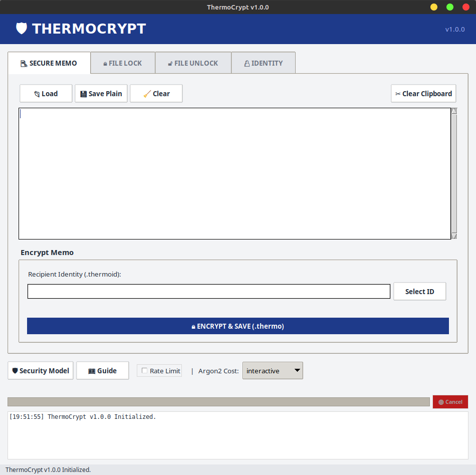

# ThermoCrypt: A Hybrid Post-Quantum Cryptographic Implementation with Hardware Binding


[](https://zeitge.github.io/thermocrypt/flowchart.html)


## Abstract

**ThermoCrypt** is a proof-of-concept implementation of a Hybrid Key Encapsulation Mechanism (KEM) designed to mitigate threats posed by future quantum computing capabilities while maintaining resistance against classical cryptanalysis.

The system integrates **ML-KEM-768 (Kyber)** -- a Module-Lattice-based Key Encapsulation Mechanism selected by NIST-conjoined with **X25519** (Elliptic Curve Diffie-Hellman). This hybrid approach ensures that confidentiality is preserved even if one of the underlying mathematical problems is solved. Furthermore, the system employs **ML-DSA-65 (Dilithium)** for cryptographic identity verification and **Argon2id** for memory-hard key derivation.

> **PROJECT STATUS:** This repository is published as a static research artifact (v1.0.0). It serves as a reference implementation for Hybrid PQC combined with Hardware Binding logic.

## Interface

The project includes a Python-based GUI wrapper for demonstration purposes, visualizing the underlying cryptographic operations.



## Scope of Verification & Capabilities

**1. Verified Environments**
* **Linux (x86_64):** Fully functional. Supports both `Disk` mode and `TPM` hardware binding.
* **Windows (x64):** Fully functional. Supports `Disk` mode.

**2. Binding Modes**
* **Disk Mode (Standard):** Keys are encrypted with Argon2id (v1.3) and stored on disk. This mode is portable and works on all supported platforms.
* **TPM Mode (Linux Only):** Keys are generated inside and mathematically bound to the machine's **TPM 2.0** chip. The private key cannot be exported or used on another machine, providing physical theft protection.

## Cryptographic Primitives

The architecture relies on the following primitives:

| Component | Algorithm | Standard/Reference |
| :--- | :--- | :--- |
| **Post-Quantum KEM** | ML-KEM-768 (Kyber) | NIST FIPS 203 |
| **Classical KEM** | X25519 | RFC 7748 |
| **Signature Scheme** | ML-DSA-65 (Dilithium) | NIST FIPS 204 |
| **Symmetric Encryption** | XChaCha20-Poly1305 | IETF |
| **Key Derivation** | Argon2id | RFC 9106 |
| **Hardware Binding** | RSA-OAEP-2048 | TPM 2.0 Spec |

## Build Instructions

### Prerequisites
* **Compiler:** C++17 compliant compiler (`g++` or `clang`).
* **Libraries:** `libsodium`, `liboqs`.
* **Linux Only:** `tpm2-tss` (specifically `libtss2-esys`, `libtss2-mu`, `libtss2-tctildr`).

### Linux (Debian/Ubuntu)

Use this command to compile with full TPM support:

```bash
# 1. Install dependencies
sudo apt install build-essential libsodium-dev libssl-dev libtss2-dev

# 2. Compile Core
g++ -o thermo_core thermo_core.cpp \
    -std=c++17 -O3 \
    -DENABLE_TPM \
    -lsodium -loqs -ltss2-esys -ltss2-mu -ltss2-tctildr
```

### Windows (MinGW64 / MSYS2)

Windows compilation supports `Disk` mode only. Ensure `libsodium` and `liboqs` are installed in your MinGW environment.

```bash
# Compile Core (Static linking recommended for portability)
g++ -o thermo_core.exe thermo_core.cpp \
    -std=c++17 -O3 \
    -static \
    -lsodium -loqs -lws2_32
```
## Deep Dive: Interactive Learning

Explore the internal workings of ThermoCrypt through our interactive browser-based tools:

### 1. System Architecture
**[Interactive Flowchart](https://zeitge.github.io/thermocrypt/flowchart.html)**:
A complete visual map of the cryptographic data flow. Click on any node (Generation, Encryption, Decryption) to see technical implementation details, memory security measures (RAII/mlock), and specific algorithms used.

### 2. Hands-on Experience
**[CLI Simulator](https://zeitge.github.io/thermocrypt/simulator.html)**:
Simulate how ThermoCrypt works. Use this web-based terminal simulator to run `gen`, `encrypt`, and `decrypt` commands and see exactly what happens under the hood.

### 3. Cryptographic Implementation
**[Hybrid KDF Lab](https://zeitge.github.io/thermocrypt/hybrid.html)**:
Visualize the "Hybrid" aspect of the protocol. This lab demonstrates how the Post-Quantum shared secret (Kyber) and the Classic shared secret (X25519) are cryptographically mixed (Blake2b) to derive the final Master Key.

## Usage

The primary engine is the Command Line Interface (CLI). The GUI is a wrapper around these commands.

**1. Identity Generation** Generates a signed identity file (`.thermoid`) and an encrypted vault.

```bash
# Standard (Portable)
./thermo_core --gen <alias>

# Hardware Bound (Linux Only - Requires Root)
sudo ./thermo_core --gen <alias> --bind tpm
```

**2. Encryption** Encrypts a file using the recipient's public identity.

```bash
./thermo_core --encrypt <input_file> <recipient.thermoid>
```

**3. Decryption** Decrypts a file using the private vault and password.

```bash
# Standard
./thermo_core --decrypt <encrypted_file.thermo> <alias>

# If using TPM identity (Requires Root)
sudo ./thermo_core --decrypt <encrypted_file.thermo> <alias>
```

**4. TPM Management (Linux)** To clear a stored key from the TPM chip (Handle `0x81018100`):

```bash
sudo tpm2_evictcontrol -C o -c 0x81018100
```

## License

This project is licensed under the **MIT License**.
See the [LICENSE](LICENSE) file for details.

The software is provided "as is", without warranty of any kind, express or implied.
